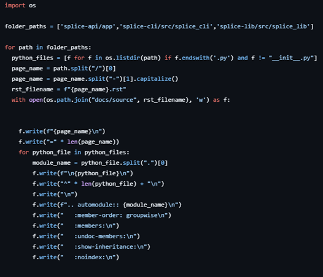

After creating a new repository to be documented, go to your ReadTheDocs dashboard. Click the Add Project button and locate the repository you want to document. You can change the name and/or default branch for the project if needed.

Back in your repository, ensure that there is:

- a .readthedocs.yaml file
- a pyproject.toml and/or requirements.txt file
- the required files for Sphinx: make.bat, Makefile, conf.py and index.rst

## File Descriptions

### .readthedocs.yaml

This is the main configuration file for RTD. It defines:

- OS and tools: e.g. Ubuntu, Python 3.12
- Dependency installation: e.g. using uv
- Sphinx configuration:
  - Path to conf.py
  - "fail_on_warning": true (stops the pages from building even if the error would not normally crash Sphinx, recommended for debugging)
- Output formats: In addition to HTML, can build PDF and EPUB

RTD uses this file to configure the environment and build process when generating the documentation.

### pyproject.toml/requirements.txt

These files specify your project’s dependencies  
In the example repo, both are included, but for simplicity, you can use only pyproject.toml.

RTD uses these to install any packages needed for documentation generation (e.g., Sphinx, extensions, imports for your Python files).

### Sphinx files

The files in the first bullet point are automatically made if you use sphinx-quickstart.

- Makefile/make.bat: Only necessary if you want to manually build the documentation pages as RTD directly runs sphinx-build
- conf.py: Main configuration for Sphinx
- index.rst: Homepage

### conf.py

Configuration options for sphinx, includes:

- Project metadata
- Extensions for Sphinx (like autodoc and autosummary)
- Path configurations for finding the directories that your Python files are in (uses sys and os modules)

The most important file for controlling how your documentation is formatted and controlled during generation

### index.rst

This is the homepage of your documentation.

It is good practise to include a complete toctree here, as any .rst files that are not mentioned in a toctree will not be built and will give off a warning that, if configured, could cause a build failure.

Once these are in place, you can choose whether you want to manually write up your .rst files or create a python script like the example to generate pages from specific directories. Any python scripts that need to be run must be put in the .readthedocs.yaml file to be run by RTD when it builds the pages.

### Example

## Extra info

RTD runs the code in .readthedocs.yaml and then uses a set of python commands to create the web pages from the sphinx .rst files, and then runs the commands needed to create the .pdf and .epub forms of the page. In theory, could be manually done if you go through each step in the command prompt but the virtual environment refuses to install the sphinx-build function necessary to construct the .html files from the .rst files. May be a problem with the install method (using uv) but I can look further into it if necessary.

https://docs.readthedocs.com/platform/latest/tutorial/index.html

# Docstrings

Docstring examples are meant for Sphinx, syntax may differ if not using Sphinx for your documentation.

## Template

\[imports\]

\_\_doc__ = """\[Docstring for entire program\]"""

define error

  """Explanation of what causes error to occur"""

define function

  """
  
  \[Single line summary\]
  
  \[Extended explanation of function\]
  
  :param \[ParamName\]: \[ParamDescription\], defaults to \[DefaultParamVal\]
  
  :type \[ParamName\]: \[ParamType\](, optional)
  
  (repeat for every parameter)
  
  :raises \[ErrorType\]: \[ErrorDescription\]
  
  (repeat for every error)
  
  :return: \[ReturnDescription\]
  
  :rtype: \[ReturnType\]
  
  """

## Full docstring example

from fastapi import FastAPI

\_\_doc__ = """This should describe the purpose of this file"""

class ExampleError(Exception):
  
  """ Raised if the parameter is not a string"""
  
  pass

def exampleFunction(example):
  
  """
  
  Description of this function
  
  Extended descriptions will appear on automodules but not on the autosummaries (i.e. on the individual pages vs on the summaries page).
  
  This text can be as long as you like, and you can put a blank line between paragraphs in your description
  
  like so, to format them properly
  
  :param example: Word that will be passed into exampleFunction
  
  :type example: string, not optional
  
  :raise example_file.ExampleError: If the parameter is not a string
  
  :return: The string backwards
  
  :rtype: string
  
  For example:
  
  .. code-block:: python
  
  from example_file import exampleFunction
  
  print(exampleFunction('This is an example string'))
  
  \>>>gnirts elpmaxe na si sihT
  
  """
  
  try:
  
  if type(example) != str:
  
    raise ExampleError
  
  except ExampleError:
  
    print("Not a string")
    
    return
  
  return example\[::-1\]

print(exampleFunction("This is an example string"))

 
 
Classes use the same syntax, like this:

class ClassName():

  """

  This is a description of ClassName

  :param firstPar: This is the first example parameter

  :type firstPar: string, not optional

  :param secondPar: This is the second example parameter

  :type secondPar: integer, optional

  """

  def \_\_init_\_(self, firstPar, secondPar=0):

    """Constructor method"""

    self.par1 = firstPar

    self.par2 = secondPar

  def classMethod(self, thirdPar):

    """

    This is the description of this method

    :param thirdPar: This is the third example parameter

    :type thirdPar: integer, non-optional

    :return: The integer passed in + 1

    :rtype: integer

    """

    return thirdPar + 1

Altogether this gives you:

[this website](https://splice-autodoc-test.readthedocs.io/en/stable/Cli.html)

Official RTD docs: [here](https://sphinx-rtd-tutorial.readthedocs.io/en/latest/docstrings.html)

When using Sphinx to create the documents, it is best to provide examples using

.. code-block:: \[language\] followed by a blank line and then the example code of how to use the module. The example in the above section is very simple but if your docstring is formatted correctly, you can make the code as long as you need it to be.
